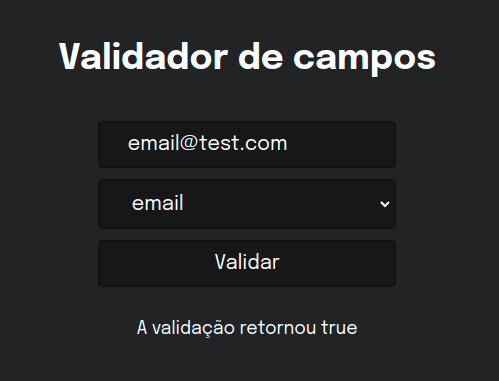

# Exercicio Validator

Boas-vindas, Esse Exercício trata se de introdução a preparação de ambiente e importação de bibliotecas, nesse caso usamos a ferramenta validator para praticar. veja como ficou 😉.



<h1 style="margin-top: 20px">Ferramentas 🧰 🛠️</h1>

<br />

<div style="display: flex">

  

  

  

  

</div>

<br />

---

## Habilidades
- preparar ambiente
- uitilizar vite
- lint
- package

<br />

<br />

# 🔨 Funcionalidades do projeto
Uma pagina que com a ajuda do [validator.js](https://www.npmjs.com/package/validator) ferifica se de acordo com a opção selecionado o input corresponde corretamente.

<br />
<br />


## Rodando o projeto 📀

Instale as dependências

```sh
npm install
```
<br />

E execute o seguinte comando:

```sh
npm run dev
```

<br />
<br />

<h1>#VQV 🚀</h1>
