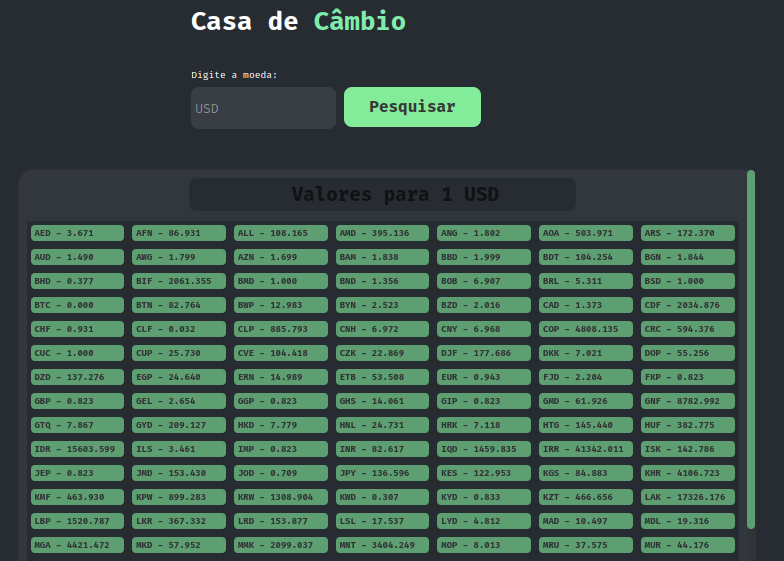

# Exercicio Casa de Cambio

Boas-vindas, Esse Exercício trata se de introdução a preparação de ambiente e importação de bibliotecas, requisição de API's, nesse casa fiz um fetch para uma api publica para praticar. veja como ficou 😉.



<h1 style="margin-top: 20px">Ferramentas 🧰 🛠️</h1>

<br />

<div style="display: flex">

  

  

  

  

</div>

<br />

---

## Habilidades
- preparar ambiente
- uitilizar vite
- fazer requisição para API
- lint
- logica,
- async/await
- try/catch
- package
- bibliotecas

<br />

<br />

# 🔨 Funcionalidades do projeto
Uma pagina que faz requisição para esta [API](https://api.exchangerate.host/latest?base=brl) e compara por exemplo outras moedas com 1 Real Brasileiro. mas é possivel pesquisar varias outras moedas e comparala com as demais.

<br />
<br />


## Rodando o projeto 📀

Instale as dependências

```sh
npm install
```
<br />

E execute o seguinte comando:

```sh
npm run dev
```

<br />
<br />

<h1>#VQV 🚀</h1>
