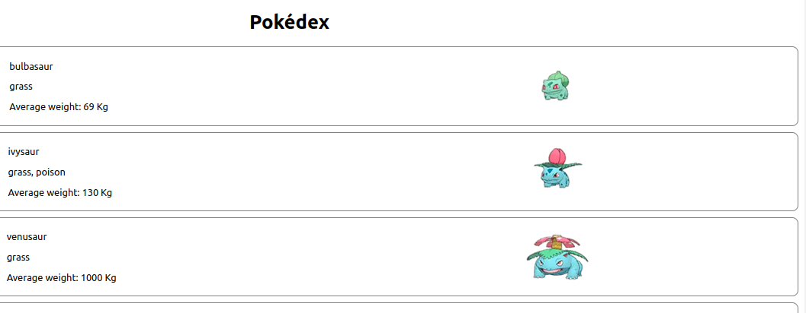

# Exercicio Pokedex

Boas-vindas, Esse Exercício trata se de introdução ao React!



<h1 style="margin-top: 20px">Ferramentas 🧰 🛠️</h1>

<br />

<div style="display: flex">

  

  

  

  
</div>

<br />

---

## Habilidades
- criar um projeto React
- Componentes React
- Props entre componentes

<br />

<br />

# 🔨 Funcionalidades do projeto
Uma pagina que lista alguns pokemons e informa seu tamnho e seu tipo.

<br />
<br />


## Rodando o projeto 📀

Instale as dependências

```sh
npm install
```
<br />

E execute o seguinte comando:

```sh
npm run start
```

<br />
<br />

<h1>#VQV 🚀</h1>
